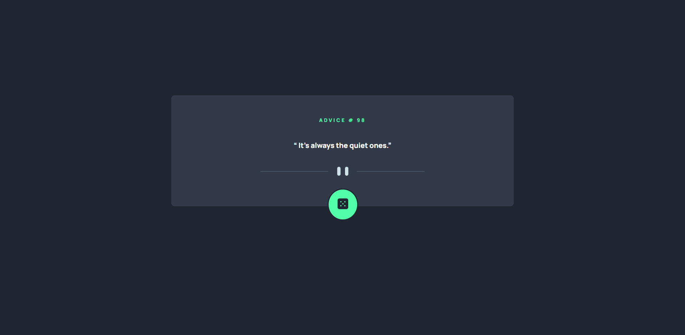

# Frontend Mentor - Advice generator app solution

This is a solution to the [Advice generator app challenge on Frontend Mentor](https://www.frontendmentor.io/challenges/advice-generator-app-QdUG-13db). Frontend Mentor challenges help you improve your coding skills by building realistic projects.

## Table of contents

- [Overview](#overview)
  - [The challenge](#the-challenge)
  - [Screenshot](#screenshot)
  - [Links](#links)
- [My process](#my-process)
  - [Built with](#built-with)
  - [What I learned](#what-i-learned)
  - [Continued development](#continued-development)
  - [Useful resources](#useful-resources)
- [Author](#author)
- [Acknowledgments](#acknowledgments)

## Overview

### The challenge

Users should be able to:

- 

### Screenshot

### Links

- Solution URL: [Add solution URL here](https://your-solution-url.com)
- Live Site URL: [Add live site URL here](https://your-live-site-url.com)

## My process

### Built with

- Semantic HTML5 markup
- CSS custom properties
- Flexbox
- CSS Grid
- Mobile-first workflow

### What I learned
First time using fetch API
and first time adding my project from git bash

### Useful resources

https://www.taniarascia.com/how-to-connect-to-an-api-with-javascript/?fbclid=IwAR1aq7lLEnEs9-rp_V_kwkOJEwNwdi2rcyBdCFiaHHE2aBuCgF-021fmGWE

MDN 
https://developer.mozilla.org/en-US/docs/Learn/JavaScript/Client-side_web_APIs/Introduction

## Author

- Website - [Desp](https://github.com/superozzy/advice-generator)
- Frontend Mentor - [superOzzy](https://www.frontendmentor.io/profile/superozzy)

